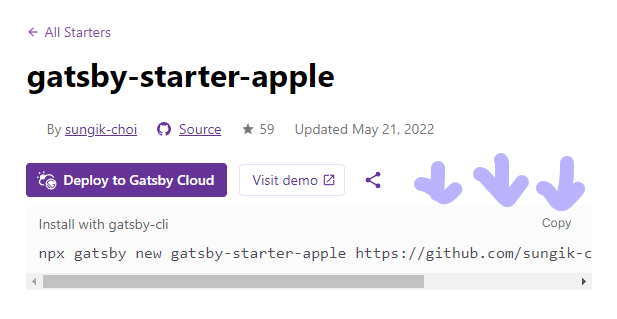
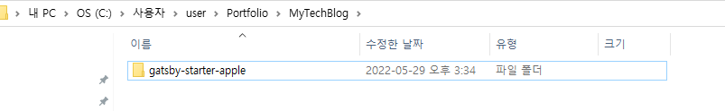

## Gatsby 블로그 시작하기

naver 나 tistory 등 블로그 사이트들은 많지만  
굳이굳이 github 블로그를 시작한 이유는...   

바로...😮   

깃허브에 잔디를 쉽게 심고 싶기 때문입니다아..(별거없음)  


회사를 다니면서 깃허브에 잔디를 심기가 쉽지 않았는데  
블로그 포스팅만 해도 잔디를 심을 수가 있다면?😮
굳이 다른 블로그를 사용할 이유가 없다는 생각이 들었습니다.   


근데 github 블로그에도 여러 종류가 있습니다.

- Jekyll 기반
- Gatsby 기반

사실 정보인프라나 테마다양성은 Gatsby 보다 Jeykll 이 더 좋습니다.   

하지만 저는 React 와 GraphQL 를 공부할 겸!
Gatsby 기반 블로그 테마를 사용하기로 결심했습니다.  
(제가 선택한 블로그 테마가 React 와 GraphQL 기반이었습니다.)  


## Gatsby-cli 설치하기

설치를 원하는 디렉토리로 이동 후 다음 명령어를 입력해줍니다.

```bash
npm install -g gatsby-cli
```


## Gatsby 테마 설치하기

시작하기 전에,  
만들고 싶은 블로그 테마를 골라야 합니다.  

[Gatsby 블로그 모음](https://www.gatsbyjs.com/starters/?v=2 "Gatsby Site")  

블로그 말고도 굉장히 많은 테마가 있습니다.
나중에 포트폴리오 만들 때도 사용할 수 있습니다.  


저는 
[🍎 gatsby-starter-apple](https://www.gatsbyjs.com/starters/sungik-choi/gatsby-starter-apple "Gatsby Site")
라는 블로그 테마를 선택했습니다.  


고른 테마를 로컬에 설치하기 위해 밑의 코드를 입력헤줍니다.

```bash
npx gatsby new [만들 사이트] [소스코드 주소]
```

제가 선택한 사이트를 예시로...



여기 적혀있는 코드를 복사해서 사용하면 됩니다.


오류가 발생하지 않았다면

지정한 경로에 **Gatsby 블로그**가 만들어집니다.


## gatsby 블로그 로컬에서 띄우기

gatsby 블로그를 발행하기 전에, 글이 잘 써졌는지 로컬에서 확인해줍니다.

일단 설치한 블로그로 경로를 이동해준후...🐾

```bash
cd [블로그 이름]
```

밑의 명령어를 입력해주면 로컬에서 gatsby 블로그를 띄울 수 있습니다.

```bash
gatsby develop
```


## 오류 발생 시 해결하기 링크

1. [Gatsby-cli 설치 시 오류](https://www.gatsbyjs.com/starters/?v=2 "Gatsby Site")   
2. [Gatsby 테마 설치 시 오류](https://www.gatsbyjs.com/starters/?v=2 "Gatsby Site")  