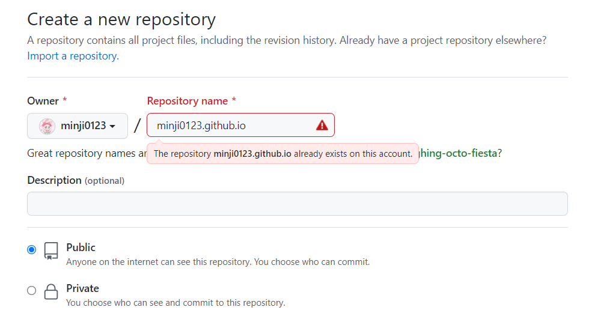
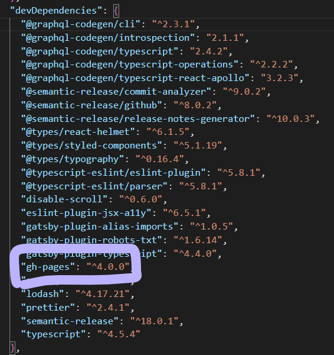
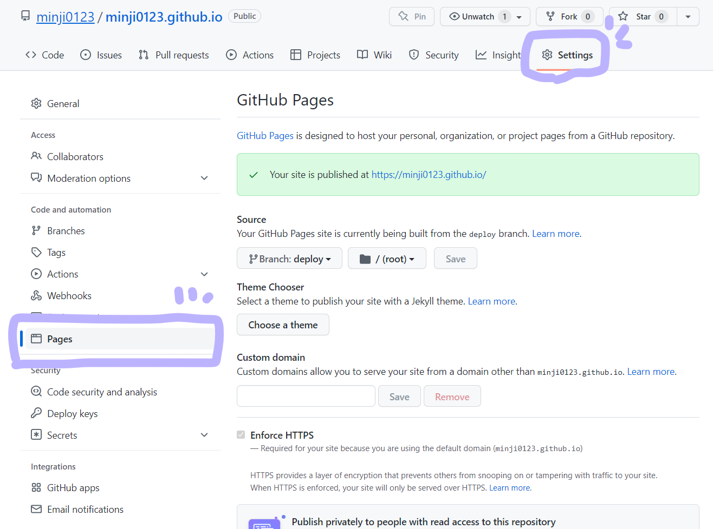
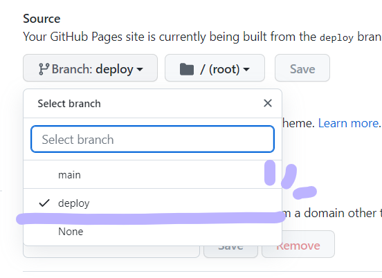
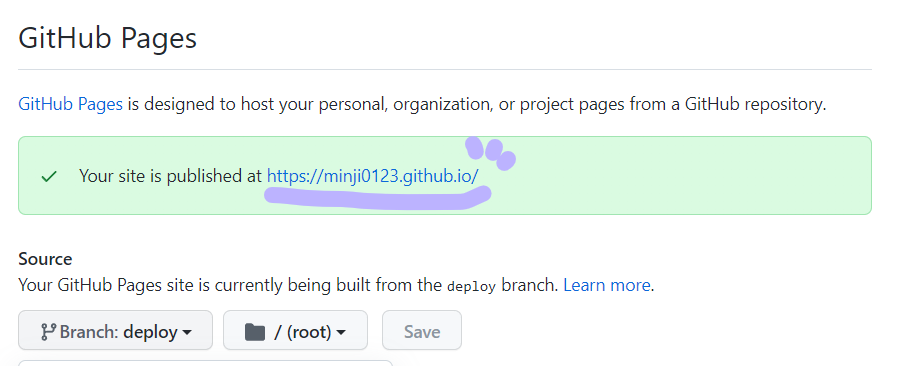

## GitHub 에 블로그 등록하기

우선 자신의 github 에 들어가서, 새로운 repository 를 만들어야 합니다.  

이름은 [자신의UserName].github.io 로 지어줍니다.  

   

repository 를 다 만들고 난 후에는 개인 프로젝트를 init 해주듯 해주시면 됩니다.   

만들었던 Gatsby 블로그 디렉토리로 이동 후 다음 명령어들을 입력해 repository 를 활성화시켜줍니다.   

```bash
git init
git add .
git commit -m "first commit"
git branch -M main
git remote add origin [자신의github주소]
git push -u origin main
```

## Gatsby 블로그 세팅하기_bash

블로그를 배포하기 위해서는 블로그 세팅을 변경해줘야 합니다.  
우선 다음 명령어를 입력해 dependency 를 추가해줍니다.  

```shell
npm install gh-pages --save-dev
```

만약 설치 시 오류가 발생한다면 
명령어 뒤에 --force 를 추가해서 설치해줍니다.   

package.json 의 devDependencies 에 다음과 같이 추가됩니다.  



## Gatsby 블로그 세팅하기_json

이어서   
package.json 의 script 에 다음 명령어를 추가해줍니다.


```json
{
  "scripts": {
    ...,
    ...,
    "deploy": "npm run clean && gatsby build && gh-pages -d public -b deploy"
  }
}
```

- npm run clean: 은 제외해도 됩니다. 처음에 branch 를 잘못 등록해서 중복 오류나 발생했기 때문에 제가 임의로 추가했습니당... 출처는 밑에!


- gatsby build: 빌드 명령어 입니다.  

- gh-pages -d public -b deploy: public 으로 배포하는 명령어입니다. -b 뒤의 이름은 branch 이름입니다. 원하는 이름으로 바꿔주셔도 됩니다.  

--- 

여기까지 잘 설정했으면 터미널로 돌아와 다음 명령어를 입력해줍니다.  

```bash
npm run deploy
```

## Gatsby 블로그 세팅하기_github

마지막으로 github 환경설정을 해줍니다.  

repository 로 들어간 후, settings -> pages 로 이동합니다.  



위의 사진에서 보이는 것 처럼 세팅을 바꿔줍니다.  
branch 를 아까 변경했던 이름으로 설정해줘야 합니다.  




그 후 활성화된 주소로 들어가보면  
Gatsby 블로그로 이동할 수 있습니다.  

 


## reference
- http://daplus.net/node-js-npm-%ED%81%B4%EB%A6%B0-%EB%AA%A8%EB%93%88/