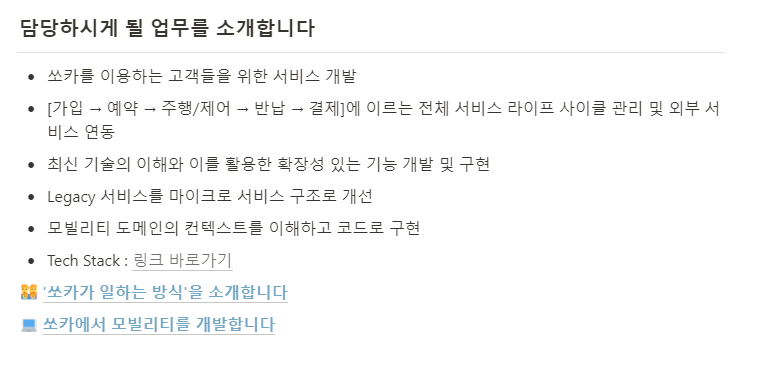
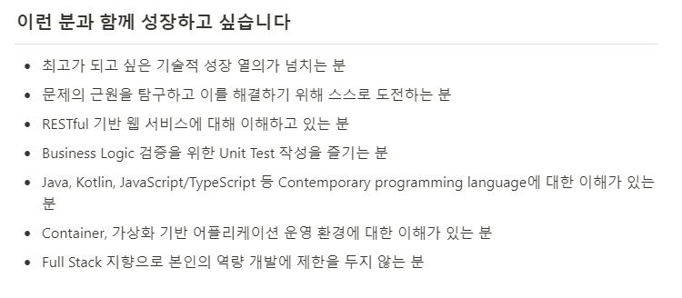
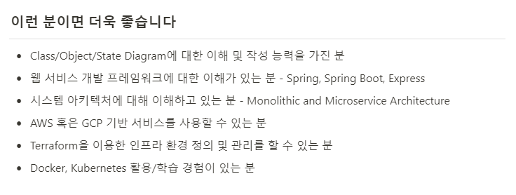

<!-- 

 -->

### 기술 스택

---

https://stackshare.io/socar/software-engineer

### 담당하시게 될 업무를 소개합니다

---

- 쏘카를 이용하는 고객들을 위한 서비스 개발
- [가입 → 예약 → 주행/제어 → 반납 → 결제]에 이르는 전체 서비스 라이프 사이클 관리 및 외부 서비스 연동
- 최신 기술의 이해와 이를 활용한 확장성 있는 기능 개발 및 구현
- Legacy 서비스를 마이크로 서비스 구조로 개선
- 모빌리티 도메인의 컨텍스트를 이해하고 코드로 구현

### 이런 분과 함께 성장하고 싶습니다

---

- 최고가 되고 싶은 기술적 성장 열의가 넘치는 분
- 문제의 근원을 탐구하고 이를 해결하기 위해 스스로 도전하는 분
- RESTful 기반 웹 서비스에 대해 이해하고 있는 분
- Business Logic 검증을 위한 Unit Test 작성을 즐기는 분
- Java, Kotlin, JavaScript/TypeScript 등 Contemporary programming language에 대한 이해가 있는 분
- Container, 가상화 기반 어플리케이션 운영 환경에 대한 이해가 있는 분
- Full Stack 지향으로 본인의 역량 개발에 제한을 두지 않는 분

### 이런 분이면 더욱 좋습니다

---

- Class/Object/State Diagram에 대한 이해 및 작성 능력을 가진 분
- 웹 서비스 개발 프레임워크에 대한 이해가 있는 분 - Spring, Spring Boot, Express
- 시스템 아키텍처에 대해 이해하고 있는 분 - Monolithic and Microservice Architecture
- AWS 혹은 GCP 기반 서비스를 사용할 수 있는 분
- Terraform을 이용한 인프라 환경 정의 및 관리를 할 수 있는 분
- Docker, Kubernetes 활용/학습 경험이 있는 분

쏘카의 채용 사이트에서 긁어왔습니당!
위의 글을 바탕으로 이직 준비를 하면 되겠죠!?

일단 두번째 카테고리의 항목들 부터 시작하려고 합니다.
RESTful 과 Unit Test 는 SpringBoot 에 정리하면 될 것 같구, Contemporary programming language 는 java, javaScript 를 공부하면 될 것 같습니당. (TypeScript는 나중에 시간나면...)
그 외 나머지는 ComputerScience 에 정리하면 될 듯..?

