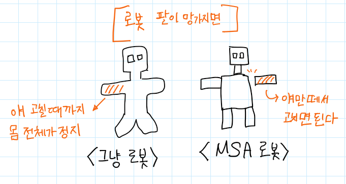

### 👀 MicroService Architecture 뜻: 
- MSA
- 소프트웨어 개발 기법 중 하나.
- ~~단일 애플리케이션을 작은 서비스 모음으로 개발하는 접근 방식~~
- 하나의 큰 애플리케이션을 여러 개의 애플리케이션으로 쪼개서, 조합과 변경이 가능하도록 만든 아키텍쳐

	과거에는 통째로 서비스를 제작했기 때문에 한 부분이 오류가 나면 전체가 오류났다.
	MSA 기법을 사용하게 되면서, 오류가 난 부분만 고치면 서비스가 정상적으로 작동하게 되었다.

### 👀 Monolithic Architecture: 
굳이 장점
여러 아키텍쳐를 생각하지 않고 빠르게 서비스를 제작할 수 있다. 
단점
어느 한 군데라도 Compile/Runtime Error가 난다면 시스템 전체가 죽어버린다.

여러 로직이 한 아키텍쳐에 있어서 생기는 문제를 해결하기 위해, 비즈니스 단위로 아키텍쳐를 쪼개보자 로 시작 

- 장애 격리와 복구
	장애가 난 아키텍쳐를 격리 후 빠르게 유지보수(리컴파일) 후 복구시킬 수 있다. 

- 비용 효율적 증설(scale-out)
	기존 Monolithic 에서는 메모리가 overflow 나면 서버 전체에 메모리를 올려야 하기 때문에 비용이 매우 비쌌다.
	MicroService 는 각각의 모듈을 ip 로 연결하기 때문에, 그냥 남는 데스크탑에다가 모듈을 올려도 된다. 

- 생산성 향상 (소스코드)
	나눠지다 보니까 모듈별로 개발자들이 집중을 할 수 있다.

- 서비스 개선 속도, 배포 속도 향상

- 신기술 도입이 쉽다.
	신기술을 도입하고 싶은 모듈을 분리시켜서 적용시켜볼 수 있다.
	polyglot 적용 (최적 언어와 DB)

### SpringBoot 2.4.2 
Spring IO Platform 
MSA 기반의 Base Framework